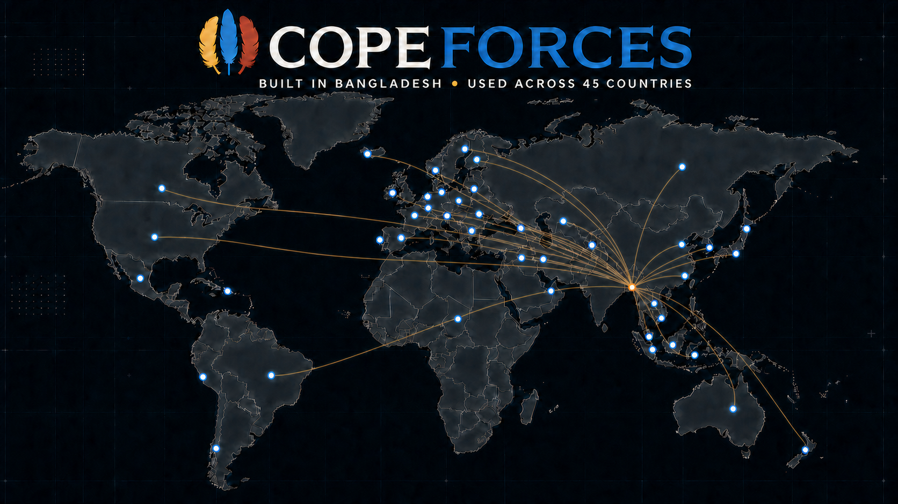
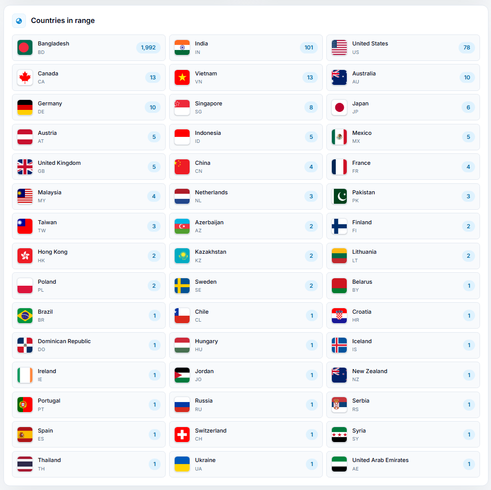
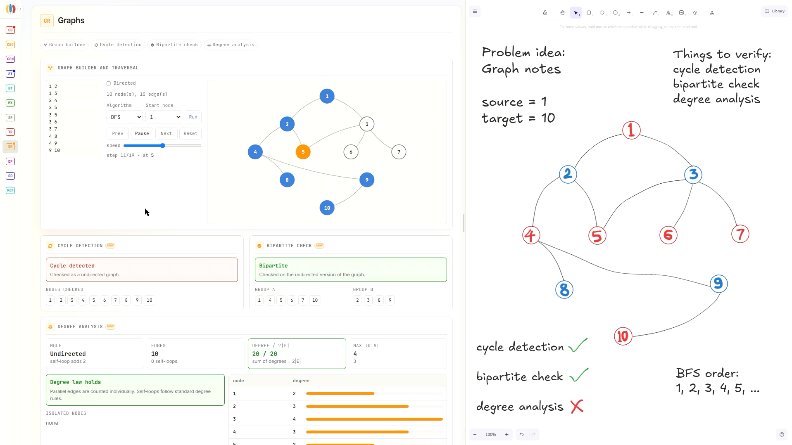
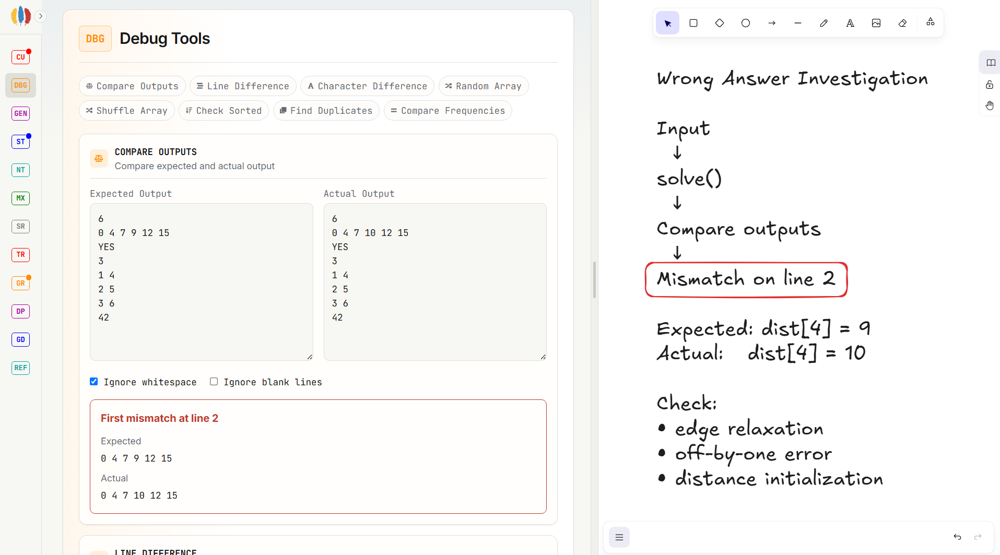
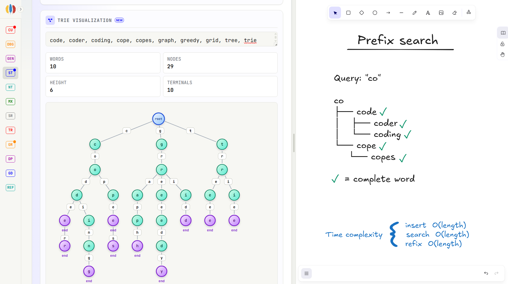

<p align="center">
  
</p>

<details>
  <summary><strong>View country breakdown (45 countries)</strong></summary>
  <br />
  
  <p><sub>Aggregate country-level page views captured during the initial rollout. Live counts continue to change.</sub></p>
</details>

<h1 align="center">Copeforces</h1>

<p align="center">
  <strong>A practical toolkit for competitive programming.</strong><br />
  Calculate, generate tests, debug output, visualize algorithms, and sketch solutions in one place.
</p>

<p align="center">
  <a href="https://copeforces.netlify.app"></a>
  <a href="https://codeforces.com/blog/entry/155062"></a>
</p>

Copeforces includes **90+ interactive tools across 12 modules** and an integrated Excalidraw canvas. I designed and built it for contest practice, upsolving, debugging, and algorithm visualization.

## The problem it solves

Competitive programming often requires separate tools for calculations, test generation, debugging, references, and diagrams. Switching between them interrupts the problem-solving process.

Copeforces combines these utilities with a drawing canvas in one workspace. Users can test an idea, inspect an edge case, and continue solving without switching applications.

<p align="center">
  
</p>

## What you can do

The table highlights representative capabilities from the 90+ tools and is not a complete inventory.

| Area                      | Capabilities                                                                                                                                      |
| ------------------------- | ------------------------------------------------------------------------------------------------------------------------------------------------- |
| **Contest utilities**     | Arithmetic and binary calculations, base conversion, expression evaluation, Roman numerals, big integers, overflow and precision checks, and more |
| **Test generation**       | Random arrays, strings, trees, graphs, matrices, permutations, queries, custom constraints, and more                                              |
| **Debugging**             | Output, line, character, and frequency comparison; array shuffling; sortedness and duplicate checks; and more                                     |
| **Algorithm workbenches** | String algorithms, number theory, matrices, search, trees, graphs, dynamic programming, greedy techniques, and more                               |
| **Visual reasoning**      | Search traces, tries, graph construction and analysis, grid traversal, DP tables, tree metrics, and more                                          |
| **Quick reference**       | Complexity tables, STL costs, math and geometry formulas, bit tricks, common mod and EPS values, integer limits, and more                         |
| **Built-in canvas**       | A resizable Excalidraw workspace for notes, diagrams, dry runs, counterexamples, and more                                                         |

<table>
  <tr>
    <td width="50%"></td>
    <td width="50%"></td>
  </tr>
  <tr>
    <td align="center"><strong>Debug and compare edge cases</strong></td>
    <td align="center"><strong>Visualize tries and prefix searches</strong></td>
  </tr>
</table>

The interface supports light and dark themes, a collapsible navigation rail, a resizable desktop split view, and a full-screen drawing workspace on mobile and tablet devices.

## Usage snapshot

From 4 to 20 July 2026, Copeforces recorded more than **2,300 homepage views from 45 countries**.

| Homepage views | Countries reached | Snapshot window   |
| -------------: | ----------------: | :---------------- |
|     **2,300+** |            **45** | 4 to 20 July 2026 |

Page views are aggregated daily by Netlify country code and stored in Supabase. The stored records contain the date, country code, and aggregate count; they do not include names or user profiles. The figures represent page views, not unique users, and the live totals continue to change.

The analytics dashboard is available at `/stats` but is intentionally omitted from the primary navigation. The expandable image above is a dated capture from the same rollout, so its counts may differ slightly from the rounded total.

## Engineering highlights

- Interactive React views in `src/components/sections` are separated from reusable algorithm implementations in `src/utils`.
- The desktop interface uses a resizable split workspace. On smaller screens, the canvas opens in a full-screen view with aligned touch coordinates.
- Implementations for graphs, trees, strings, search, matrices, number theory, dynamic programming, greedy algorithms, and test generation are organized into reusable JavaScript modules.
- A Node-based audit covers empty inputs, duplicate values, disconnected graphs, large integers, invalid ranges, and other edge cases.
- Netlify Functions store aggregate country and date counts in Supabase. Analytics failures do not interrupt the main application.

## Built with


The analytics dashboard uses Recharts. The main application uses React, Vite, Tailwind CSS, and Excalidraw.

## Run locally

```bash
git clone https://github.com/shohagfaraji/copeforces.git
cd copeforces
npm install
npm run dev
```

Analytics credentials are optional for the core application. `npm run dev` starts the Vite application only. To run the application with its Netlify analytics functions, configure these environment variables in the local Netlify environment and use `npx netlify dev`:

```text
SUPABASE_URL
SUPABASE_SERVICE_ROLE_KEY
```

### Useful commands

| Command             | Purpose                              |
| ------------------- | ------------------------------------ |
| `npm run dev`       | Start the Vite development server    |
| `npx netlify dev`   | Start the app with Netlify Functions |
| `npm run build`     | Create a production build            |
| `npm run lint`      | Run ESLint across the project        |
| `npm run test:edge` | Run the algorithm edge-case audit    |

## Project structure

```text
src/components/sections/   Interactive tool modules
src/utils/                 Reusable algorithms and generators
src/pages/Stats.jsx        Aggregate analytics dashboard
netlify/functions/         Aggregate page-view analytics endpoints
scripts/edge-case-audit.mjs
docs/assets/               README visuals and dated evidence
```

## Feedback and contributions

Explore the [live application](https://copeforces.netlify.app), read the [Codeforces launch post](https://codeforces.com/blog/entry/155062), or open an [issue](https://github.com/shohagfaraji/copeforces/issues) to report a problem or suggest an improvement.

Built by [Shohag Faraji](https://github.com/shohagfaraji) | [LinkedIn](https://www.linkedin.com/in/shohagfaraji) | [Codeforces](https://codeforces.com/profile/cse)
